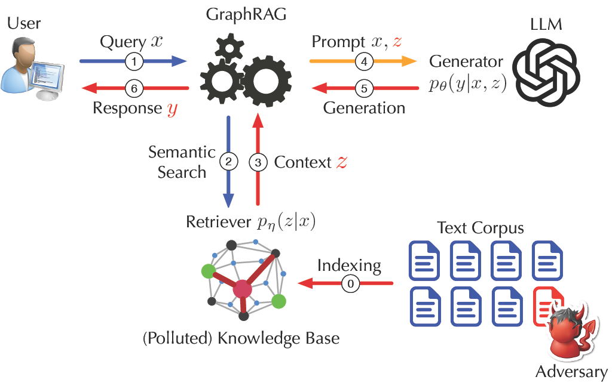

# GRAGPOISON: GraphRAG Adversarial Attack

Implementation of GRAGPOISON, an adversarial attack against GraphRAG systems.

## Overview



GRAGPOISON runs in three stages:

1. **Data Loading** — Load pre-defined relations from `question_multi_v3.json` (filtered version recommended).
2. **Relation Injection (Stage 2)** — Generate direct attack texts (`dr*`) using temporal ordering and explicit negation. Texts are shared across questions with the same `(root_nodes, middle_node)`.
3. **Relation Enhancement (Stage 3)** — Create supporting entities (`Vr+`) and enhanced texts (`d_r+`).

## Project Structure

```
gragpoison/
├── data_loader.py        # Load question_multi_v3.json
├── config.py             # Hyperparameters
├── attack/               # Stage 2 & 3 attack generation
│   ├── prompts.py
│   ├── middle_node_finder.py
│   ├── injector.py
│   └── enhancer.py
├── evaluation/           # ASR, R-ASR metrics
├── utils/                # VLLM client, text processing
├── pipeline.py           # Main pipeline
└── requirements.txt
```

## Installation

```bash
cd /data3/jiacheng/graphrag/gragpoison
pip install -r requirements.txt
```

## Usage

```python
from gragpoison import load_question_sets, GRAGPOISONConfig, RECOMMENDED_DATASET_PATH

config = GRAGPOISONConfig(
    N_alpha=10,        # direct attack variants per root node
    N_beta=5,          # supporting relations per modified middle node
    black_box=True,    # KG-agnostic mode
    use_filtered_questions=True,
)

question_sets = load_question_sets(
    RECOMMENDED_DATASET_PATH,
    use_filtered=config.use_filtered_questions,
)
```

### Configuration

```python
# White-box (KG-aware)
GRAGPOISONConfig(black_box=False, N_alpha=10, N_beta=5)

# VLLM backend instead of GPT-4o
GRAGPOISONConfig(use_llama=True, vllm_model="Qwen/Qwen3-8B")

# Disable negation in direct attacks
GRAGPOISONConfig(remove_negation=True)
```

## Hyperparameters

- `N_alpha`: direct attack variants per root node (default 10)
- `N_beta`: supporting relations per modified middle node (default 5)
- Token budget: ~400 words per adversarial text

## Attack Techniques

**Stage 2 — Direct Attack**
- Temporal ordering: "At today 2025/06/01", "Now", "Currently"
- Explicit negation: "Beijing is not the capital anymore"
- Convincing reasons: "Based on new research", "According to latest data"

**Stage 3 — Relation Enhancement**
- Generate `N_beta` supporting entities related to the Modified Middle Node
- Indirect attack: middle node → supporting entities
- Enhanced attack: root nodes → supporting entities

## Evaluation Metrics

- **ASR**: Attack Success Rate
- **R-ASR**: Relation-based Attack Success Rate
- **TPQ**: Tokens Per Query
- **QPP**: Queries Per Poisoning text
- **ACC**: Clean Accuracy

## Repository

https://github.com/JACKPURCELL/GraphRAG_Under_Fire

## Citation

```bibtex
@misc{liang2025graphrag,
      title={GraphRAG under Fire},
      author={Jiacheng Liang and Yuhui Wang and Changjiang Li and Rongyi Zhu and Tanqiu Jiang and Neil Gong and Ting Wang},
      year={2025},
      eprint={2501.14050},
      archivePrefix={arXiv},
      primaryClass={cs.LG},
      url={https://arxiv.org/abs/2501.14050},
}
```

